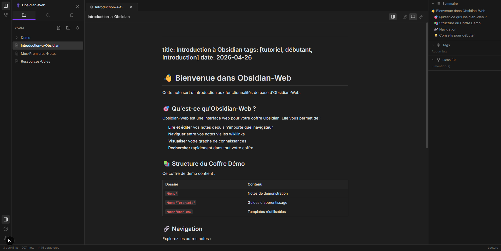

<div align="center">
  
  
  <h1>💎 Obsidian-Web</h1>
  <p><strong>A Sleek, Mobile-First Web Interface for Your Obsidian Vault</strong></p>
  
  <p>
    <a href="https://nextjs.org/"></a>
    <a href="https://reactjs.org/"></a>
    <a href="https://www.typescriptlang.org/"></a>
    <a href="https://www.docker.com/"></a>
    <a href="LICENSE"></a>
  </p>

  
</div>

---

Obsidian-Web is a high-performance, mobile-optimized web viewer and editor for your Obsidian vaults. Designed to feel familiar to Obsidian users while being accessible from any browser, it allows you to browse your notes, visualize your knowledge graph, and edit content on the go with a premium, glassmorphic UI.

## ✨ Features

- **📱 Mobile-First Design**: Fully responsive interface with touch-optimized buttons, slide-out panels, and a smooth bottom-sheet action menu.
- **📝 Real-time Markdown Editing**: Integrated CodeMirror 6 editor with syntax highlighting and automatic saving.
- **🕸️ Interactive Knowledge Graph**: Visualize the connections between your notes with a performant 2D force-directed graph view.
- **🔍 Global Search & Folders**: Quickly navigate your vault with an intuitive folder tree and a lightning-fast full-text search.
- **🔒 Secure Access**: Password-protected edit mode to ensure your notes remain private while allowing read-only access.
- **🌗 Premium Aesthetics**: A handcrafted design system featuring sleek gradients, subtle micro-animations, and a deep-space dark mode.
- **📦 Zero-Config Docker**: Ready to deploy in seconds with a multi-stage Docker build optimized for size and performance.

---

## 🛠️ Tech Stack

| Category         | Technologies Used                                                                 |
| ---------------- | --------------------------------------------------------------------------------- |
| **Frontend Core**| Next.js 15 (App Router), React 19, TypeScript                                     |
| **Styling**      | Tailwind CSS 4, Custom Vanilla CSS, Lucide React (Icons)                          |
| **Editor/Vis**   | CodeMirror 6 (Markdown, One Dark Theme), Custom Canvas Graph Implementation       |
| **Deployment**   | Docker (Multi-stage `node:22-alpine` standalone build)                            |

---

## 🚀 Getting Started

### Prerequisites

- [Node.js](https://nodejs.org/) (v20+) and npm
- [Docker](https://docs.docker.com/get-docker/) & [Docker Compose](https://docs.docker.com/compose/install/) (for container deployment)

### 1. Environment Variables

Clone the repository and set up your environment:
```bash
git clone [https://github.com/lucas-lepajollec/obsidian-web.git](https://github.com/lucas-lepajollec/obsidian-web.git)
cd obsidian-web
cp .env.example .env.local
```

Edit `.env.local` with your secure password and the absolute path to your Obsidian vault:
```env
NOTES_PATH=C:/Users/YourName/Documents/MyVault
AUTH_PASSWORD=your_secure_password
```

### 2. Local Development

Install dependencies and start the dev server:
```bash
npm install
npm run dev
```
*The application will be running at `http://localhost:3000`.*

---

## 🐳 Docker Deployment

You can deploy the application using the pre-built image, or build it locally from the source code.

### Option A: Using the Pre-built Image (Recommended)
This uses the official image hosted on GitHub Container Registry. No local build required.

Create a `docker-compose.yml`:
```yaml
services:
  obsidian-web:
    image: ghcr.io/lucas-lepajollec/obsidian-web:latest
    container_name: obsidian-web
    ports:
      - "2506:2506"
    environment:
      - NOTES_PATH=/vault
      - AUTH_PASSWORD=your_secure_password
    volumes:
      - /path/to/your/obsidian/vault:/vault
    restart: unless-stopped
```
Run: `docker compose up -d`

### Option B: Build from Source
If you want to modify the code and build your own Docker image locally.

Create a `docker-compose.yml`:
```yaml
services:
  obsidian-web:
    build: .
    container_name: obsidian-web-dev
    ports:
      - "2506:2506"
    environment:
      - NOTES_PATH=/vault
      - AUTH_PASSWORD=your_secure_password
    volumes:
      - /path/to/your/obsidian/vault:/vault
    restart: unless-stopped
```
Run: `docker compose up -d --build`

---

## 🔒 Security Best Practices

> [!WARNING]
> **Authentication**: Always use a strong, unique string for your `AUTH_PASSWORD`. Do not expose your Obsidian-Web instance to the public internet without ensuring this password is secure.

- **Reverse Proxy**: It is highly recommended to place Obsidian-Web behind a reverse proxy (like Nginx, Traefik, or Caddy) with an active SSL/TLS certificate if accessing it remotely.
- **Vault Backups**: Obsidian-Web interacts directly with your markdown files. Ensure your vault directory is regularly backed up.

---

## 📂 Project Structure
```text
obsidian-web/
├── vault/                  # Demo vault (included for testing)
├── public/                 # Static assets (favicons, images)
├── src/
│   ├── app/                # Next.js App Router (Pages, API Routes, Layouts)
│   ├── components/         # React components (Editor, Viewer, Graph, Sidebar)
│   ├── lib/                # Backend logic (Vault indexing, file operations)
│   └── globals.css         # Global styles and Tailwind directives
├── Dockerfile              # Multi-stage production build
└── docker-compose.yml      # Deployment configuration
```

---

## 🤝 Contributing

Contributions are welcome! Please read our [Contributing Guidelines](CONTRIBUTING.md) to learn how to setup your environment, and our [Code of Conduct](CODE_OF_CONDUCT.md) for details on our community standards.

---

<div align="center">
  Made with ❤️ by Lucas Lepajollec
</div>